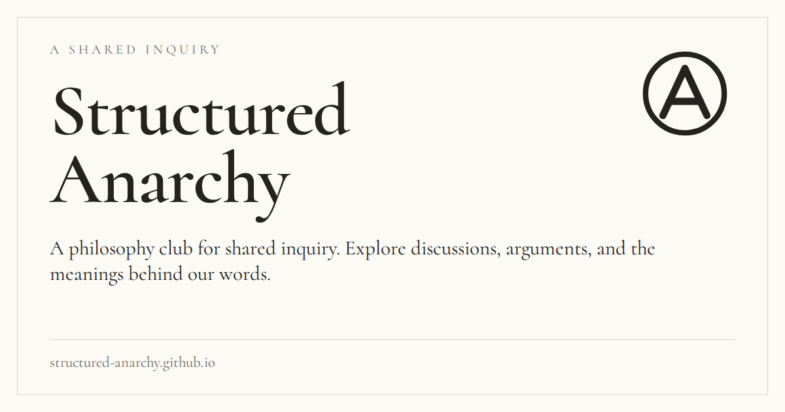

# Link previews and site icons

The initial HTML of every generated page includes public sharing metadata. It does not depend on JavaScript, a browser session, or the archive passkey. The [Open Graph properties](https://ogp.me/) describe the page title, description, canonical URL and a 1200 × 630 PNG image; matching large-image card tags provide another common metadata format. [Slack's standard link previews](https://docs.slack.dev/messaging/unfurling-links-in-messages/) crawl shared URLs, so the public HTML and image must be deployed before new previews can use them.

The default card shows the site name, public philosophy-club description, vector mark and domain in the existing cream-and-ink design. Page titles distinguish the map, discussions, and symbol directory. Public discussion notes use their public titles and excerpts; their HTML document titles remain unchanged to preserve giscus thread mappings. The 404 page is marked `noindex`.

Encrypted thesis, symbol, session and passage contents are never used in metadata or artwork. Fragment links to an individual private item deliberately share the public section card, not a private assertion or transcript excerpt. The encrypted archive and its packaging are unchanged.

## Editing the preview

- Set the public `title`, `description` and `base_url` in `site_config.toml`. `base_url` must be the deployed HTTP(S) origin, without a path, query, fragment or credentials. Canonical and image URLs are absolute. A local fixture without `base_url` omits those URL tags rather than inventing a hostname.
- Edit `site/assets/brand/icon.svg` for the vector icon and `site/branding/social-card.html` for the card artwork.
- Regenerate the checked-in PNG and ICO files after changing the brand text, domain or design:

```sh
conda run -n structured_anarchy_py pip install -r requirements-test.txt
conda run -n structured_anarchy_py python -m playwright install chromium
conda run -n structured_anarchy_py python scripts/generate_brand_assets.py
conda run -n structured_anarchy_py python scripts/build_site.py
conda run -n structured_anarchy_py pytest --browser-tests
```

The generator uses only local public fonts, the vector icon, the design template and public configuration. The normal build copies the checked-in image assets and does not require Chromium. It publishes `/favicon.ico`, a scalable SVG favicon, a 32 × 32 PNG fallback and a 180 × 180 opaque Apple touch icon. Icon selection is declared through standard [HTML icon relationships](https://developer.mozilla.org/en-US/docs/Web/HTML/Reference/Attributes/rel#icon).

## Review and deployment



Tests check rendered metadata, escaping, canonical URLs, image dimensions and icon formats, and fetch the public assets without JavaScript or archive access. These are local crawler-equivalent checks, not screenshots from WhatsApp or Slack. After merge and successful deployment, share the public URL to check each application's rendering. Apps control the final layout and may retain an older cached preview; metadata cannot force an identical appearance across them.
